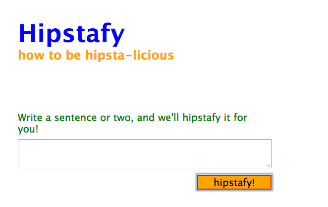

## Set Up

## Clear the stage

Close down any editors, terminal tabs from the last exercise.

In this exercise you are going to:

- connect forms to routes
- write an interesting algorithm in a separate module
- experiment with a different templating language

## Setup

Recall from the previous exercise that you can configure different templating languages when you create an express app.  Templating languages each have their benefits and drawbacks, and over time you'll get familiar with them.  For now, take a look at these three templating languages:

- http://jade-lang.com/
- https://github.com/barc/express-hbs
- https://www.npmjs.com/package/hjs

Do you remember how to generate an express app?  Go to the command line and type `express --help` to see what options you have.

For this exercise, generate a new express app called "hipstafy", and generate it using a different templating language than you used for the song-that-doesnt-end.  If you mess up the flags, just delete it and restart - no biggie.

Once it's generated, and you've CD'd into the project, be sure to run:

```
npm install
nodemon
```

## Posting forms

When a browser makes a request to your Express app, you can pull data in multiple ways.  You've already been exposed to two of these:

- from path parameters (`/add/1/2` => `/add/:num1/:num2`)
- from query parameters (`/people?id=4&order=name`)

You can also access data passed up from HTML forms using `req.body`.  Consider that you have the following form:

```html
<form action="/foo/bar" method="post">
  <input type="text" name="level">
  <input type="text" name="emotion">
  <input type="submit">
</form>
```

When a user fills in the `emotion` field with the word "Happy", and the `level` field with "very" and submits the form, here's what happens:

- The browser makes an HTTP request to the path `/foo/bar`
- The browser makes the body of the HTTP request look like this:
  ```
  emotion=Happy&level=very
  ```
- Express uses _middleware_ to parse the body and turn it into an object that looks like this:
  ```
  {emotion: "Happy", level: "very"}
  ```
- Express looks for a place where you've defined a route for a `post` to `/foo/bar`, which would look like this:
  ```js
  router.post('/foo/bar', function (req, res, next) {

  })
  ```
- That object, representing the parsed body, is available to you as `req.body`
  ```js
  router.post('/foo/bar', function (req, res, next) {
    req.body // <= this will be {emotion: "Happy", level: "very"}
  })
  ```

## Rules to memorize

- The form's action matches the path in the route file
- The form's method matches the verb in the route file
- The the input's `name` attribute becomes the key in `req.body`
- The the input's value becomes the value in `req.body`

## Instructions

Use `body-parser`, `module.exports` and `require` to accomplish the following:

1. Build a form that uses `textarea` and allows users to submit random sentences.

1. Using `POST` and `body-parser` in your route, capture the user input.
1. In `public/javascripts/hipstafy.js` write a function that returns a 'hipstafied' response using the user input.

For every word input by the user, the function should:
 - return a random hipster snippet from `models/hipstafy.js`
 - split up the user input and mix each word in between a hipster snippet.

EXAMPLE:

If the user input was "Hey what's up??", your app would return this:

```
Hey Portland Pug
what's mustache Intelligentsia
up?? Thundercats mullet
```
NOTE: The user input was 3 words, so the function returned 3 hipster snippets mixed in with the 3 words the user input.

```
module.exports = [
  "Brooklyn fap",
  "Portland pug",
  "90s sustainable quinoa ",
  "Artisan Thundercats drinking Pabst",
  "chia readymade",
  "flexitarian",
  "lo-fi fashion",
  "mustache Intelligentsia",
  "Aesthetic keytar",
  "hella beard boy",
  "Beards",
  "mixologist",
  "craftsmania",
  "like a broke ass mothafucka",
  "keytar beard",
  "Thundercats mullet",
  "dayglo milk fat",
  "zebras zebras lions and bears"
];
```

```
extends layout

block content
  h1.title= title
  h3.subtitle #{subtitle}
  div.container
      div.form
        label(id="sentence") Write a sentence or two, and we'll hipstafy it for you!
      div.form
        textarea(id="sentence", rows="4", cols="70", type="text", name="sentence")
      div.form
        input(type="submit" value="hipstafy!")
```

#### DON'T FORGET

Use `module.exports` and `require` to access the function in your routes (to pass user input to your function and get the results) and also to use the hipster snippets found in `models/hipstafy.js` in your function.
